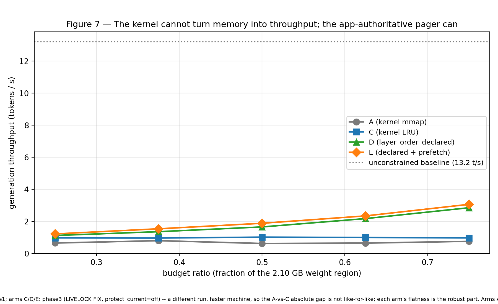

# residctl

**Application-authoritative page residency for large read-only working sets.**
An application tells the pager which pages to keep and which to evict, using
kernel primitives that already ship in Linux — `userfaultfd`, a double-mapped
`memfd`, `FALLOC_FL_PUNCH_HOLE`, cgroup v2 `memory.swap.max = 0`. No kernel
module.

The motivating workload is LLM weight streaming: inference reads a model's
layers in a fixed cyclic order, and the kernel's LRU evicts exactly the layer it
is about to need next.

## Headline result



On Qwen2.5-3B (Q4_K_M, CPU, an equal weight-residency budget per arm):

- **The kernel cannot turn extra memory into throughput on a cyclic layer
  scan.** Kernel `mmap` and kernel-LRU-via-the-pager are flat at ~0.7 and
  ~1.0 tokens/s across a 3× budget range. The app-authoritative pager rises
  **1.12 → 2.85 tokens/s (2.5×)**.
- **Kernel LRU thrashes at a ~100 % miss rate at every budget**, reading the
  whole 2 GB model on every scan (134–144 GB per 64 tokens, even at a 0.75
  budget ratio).
- **App-authoritative residency reads 13–69 % fewer bytes than kernel LRU** and
  lands at **1.08–1.13× the offline (Belady) optimum** at every ratio.
- **Correctness:** byte-identical token sequences, `mmap` load vs `residctl`
  load; T-1…T-7 pass with `--eager-reconcile`, `mismatches = 0`.

## Reading order

| # | document | one line |
|---|---|---|
| 1 | [`docs/01-problem.md`](docs/01-problem.md) | why kernel LRU degenerates on a cyclic layer scan |
| 2 | [`docs/02-design.md`](docs/02-design.md) | the mechanism as it stands — invariants, architecture, policies |
| 3 | [`docs/03-methodology.md`](docs/03-methodology.md) | the arms, the metric, the OPT bound, the correctness harness |
| 4 | [`results/findings.md`](results/findings.md) | **the results** — the argument in eight steps |
| 5 | [`results/claims.md`](results/claims.md) | each claim, its evidence, its strength, its caveats |
| — | [`results/superseded.md`](results/superseded.md) | every number that moved, and why — the audit trail |
| — | [`docs/design-history.md`](docs/design-history.md) | the 14 spec amendments and the seven concurrency bugs |
| — | [`docs/project-log.md`](docs/project-log.md) | the campaign-by-campaign narrative |
| — | [`experiments/README.md`](experiments/README.md) | index: every experiment, its question, its answer |

## Quick start

```
cd src && make
bash scripts/run-correctness-harness.sh      # T-1..T-5
bash scripts/run-storm-t6-t7.sh              # T-6, T-7
```

Full rebuild including the real model: [`docs/06-reproduce.md`](docs/06-reproduce.md).

## What this is not

One 3B dense model, CPU-only, a 2 GiB region. One shared WSL2 VM — **no
bare-metal comparison anywhere in the project**. The synthetic compute phase is
a busy loop, not real matmul. Limitations in full:
[`docs/05-limitations.md`](docs/05-limitations.md).
